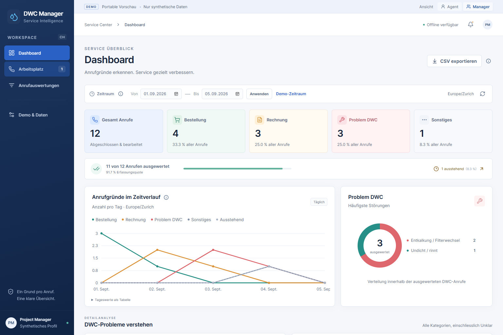
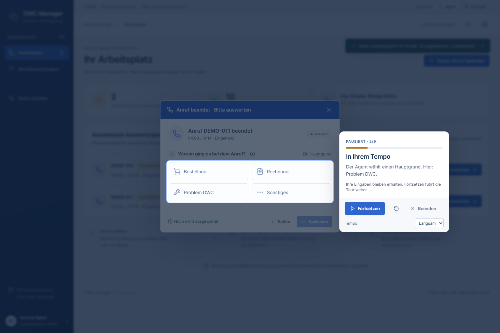
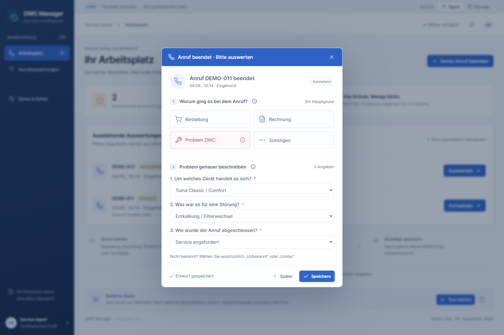
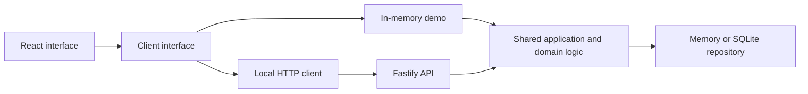

<div align="center">

# DWC Call Manager

**Turn a finished call into a clear reason, an actionable detail, and a useful report.**

A German-language call-center prototype with guided onboarding, synthetic data, and a demo you can share in one link.

[**Open the live demo →**](https://ademord.github.io/dwc-call-manager/) · [Download the offline demo](https://github.com/Ademord/dwc-call-manager/releases/latest/download/dwc-call-manager-demo.html) · [Demo walkthrough](docs/DEMO-GUIDE.md)


</div>

[](https://ademord.github.io/dwc-call-manager/)

## Try it in a minute

1. Open the **[live demo](https://ademord.github.io/dwc-call-manager/)** in a current Chrome or Edge browser. No account or installation is needed.
2. Select **Tour starten**. Watch an agent classify a call, answer three DWC questions, save the result, and see the manager report update.
3. Select **Bericht erkunden** to explore the chart, apply a date range, and export the displayed snapshot as CSV.

Pause the tour at any time and take over. Hover, focus, or tap the **i** buttons for contextual help.

The shared demo starts with **12 synthetic calls, 10 evaluated and 2 pending**. It runs in browser memory and resets on reload. Dates are fixed in September 2026 so the walkthrough is repeatable. The app makes no API calls and sends no call records to a server. The hosting provider still serves the page normally.

## What it does

| For the agent | For the manager |
| --- | --- |
| Choose Bestellung, Rechnung, Problem DWC, or Sonstiges | See reason counts, shares, daily trends, and pending work |
| Answer device, fault, and resolution questions for DWC calls | Break down DWC problems by fault, device, and outcome |
| Save a draft, finish later, or correct a saved result | Filter inclusive dates in Europe/Zurich |
| Retry an interrupted save without duplicating the revision | Export the exact displayed report snapshot as CSV |

### Guidance inside the real workflow

The tour uses the same forms and save handlers as manual work. A spotlight keeps the active control visible while the rest of the screen darkens. It supports keyboard navigation, pause/resume, three speeds, reduced motion, and responsive positioning. The report walkthrough advances at your pace and downloads only when you select Export.



<details>
<summary><strong>See the DWC detail form</strong></summary>



</details>

## Run locally

Use **Node.js 24.16 or newer** and npm. The local version saves acknowledged changes in SQLite and binds to loopback only.

```sh
git clone https://github.com/Ademord/dwc-call-manager.git
cd dwc-call-manager
npm ci
npm run build
npm start
```

Open **http://127.0.0.1:4318/**. The database is created at `work/local-prototype.sqlite`. No credentials or environment variables are required. For development, run `npm run dev` and open `http://127.0.0.1:4317/`.

Prefer a single file? Download the [offline demo](https://github.com/Ademord/dwc-call-manager/releases/latest/download/dwc-call-manager-demo.html) and open it in a browser. Or run `npm run build:demo` and open `demo/dist/index.html`. Its scripts, styles, icons, and fixture data are bundled into the HTML.

## How it is built



**React · TypeScript · Vite · Fastify · SQLite · Playwright**

Both demo modes share validation, revision handling, report calculations, and CSV generation. The code separates UI, client adapters, application logic, and persistence so those boundaries can evolve independently. This repository is an application prototype; it does not publish an npm library.

## Scope and limits

This is an independent product prototype for demonstrating call classification and reporting. All calls and identities are synthetic. Product labels illustrate the taxonomy; no manufacturer affiliation or endorsement is implied.

The Agent/Manager switch is a demo control, not authentication. There is no live telephony integration, real service-order creation, offline synchronization, or production deployment. The SQLite implementation stores one bounded JSON state document and supports one local API process. Its **10,000-call guardrail is not a capacity benchmark**; the 100,000–150,000-call scenarios remain planning questions. Do not use this build for real caller information or expose the local API publicly.

## Documentation

- [Demo guide](docs/DEMO-GUIDE.md): guided journey, manual exploration, and failure demonstrations.
- [Architecture](docs/ARCHITECTURE.md): current design, contracts, and deployment boundaries.
- [Local engine and API](docs/LOCAL-ENGINE.md): persistence, retries, backup, reporting, and explicit limits.
- [Roadmap](TODO.md): requirements for a supported pilot and larger volumes.
- [Contributing](CONTRIBUTING.md) · [Security and data handling](SECURITY.md) · [Changelog](CHANGELOG.md).
- [Third-party notices](THIRD_PARTY_NOTICES.md), also embedded in the offline demo.

## Check the build

```sh
npm run build
npm test
npx playwright install chromium
npm run test:ui
```

On Windows, browser tests use installed Edge by default. The suite contains **16 engine/API tests and 26 browser tests**, covering persistence, retry behavior, report consistency, CSV, and guided interactions on desktop and mobile viewports. All 42 passed locally for this release. A [GitHub Actions template](docs/ci-workflow.yml.example) installs Chromium on Linux, runs the checks, and deploys only after they pass; it is not enabled in this repository yet.

Run `npm run screenshots` after building to regenerate the README images from the portable demo. See [Contributing](CONTRIBUTING.md) for the rest of the development workflow.
